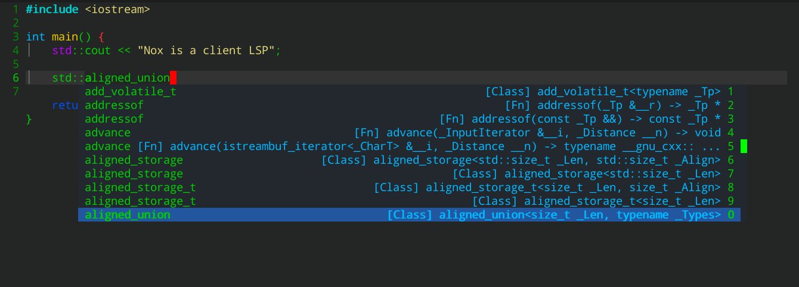

# Nox

Nox is a LSP client for Emacs, code fork from [eglot](https://github.com/joaotavora/eglot).

The project has three goals:
1. Function: only provide core functions, include code completion, jump definition, code references and rename
2. Design: Keep UX simple and clean, does not interfere user
3. Performance: cutting useless functions, optimizing code efficiency, ensure coding fluency



## Why named Nox?

The Nox are considered to be a member of the Alliance of Four Great Races", along with the Alterans, Asgard, and Furlings.

My favorite a word from Nox:

```Maybe one day you will learn, that your way is not the only way -- Anteaus```

# Install dependences

Nox depend on [company-mode](https://github.com/company-mode/company-mode) and [posframe](https://github.com/tumashu/posframe)

# Install

1. Clone this repository and put nox.el in your load-path

2. Add below configure in your ~/.emacs

```elisp
(require 'nox)

(dolist (hook (list
               'js-mode-hook
               'rust-mode-hook
               'python-mode-hook
               'ruby-mode-hook
               'java-mode-hook
               'sh-mode-hook
               'php-mode-hook
               'c-mode-common-hook
               'c-mode-hook
               'c++-mode-hook
               'haskell-mode-hook
               ))
  (add-hook hook '(lambda () (nox-ensure))))
```
3. Open file, that's all.

<a name="connecting"></a>
# Connecting to a server

`M-x nox` can guess and work out-of-the-box with these servers:

* Javascript's [javascript-typescript-stdio][javascript-typescript-langserver]
* Rust's [rls][rls]
* Python's [pyls][pyls]
* Ruby's [solargraph][solargraph]
* Java's [Eclipse JDT Language Server][eclipse-jdt]
* Bash's [bash-language-server][bash-language-server]
* PHP's [php-language-server][php-language-server]
* C/C++'s [ccls][ccls]  ([cquery][cquery] and [clangd][clangd] also work)
* Haskell's [IDE engine][haskell-ide-engine]
* Elm's [elm-language-server][elm-language-server]
* Kotlin's [kotlin-language-server][kotlin-language-server]
* Go's [gopls][gopls]
* Ocaml's [ocaml-language-server][ocaml-language-server]
* R's [languageserver][r-languageserver]
* Dart's [dart_language_server][dart_language_server]
* Elixir's [elixir-ls][elixir-ls]
* Ada's [ada_language_server][ada_language_server]
* Scala's [metals][metals]
* TeX/LaTeX's [Digestif][digestif]
* Dockerfile's [dockerfile_language_server][dockerfile_language_server]
* HTML [html_language_server][html_language_server]
* CSS's [css_language_server][css_language_server]
* JSON's [json_language_server][json_language_server]

I'll add to this list as I test more servers. In the meantime you can
customize `nox-server-programs`:

```lisp
(add-to-list 'nox-server-programs '(foo-mode . ("foo-language-server" "--args")))
```

Let me know how well it works and we can add it to the list.

To skip the guess and always be prompted use `C-u M-x nox`.

## Connecting via TCP

The examples above use a "pipe" to talk to the server, which works
fine on Linux and OSX but in some cases
[*may not work on Windows*][windows-subprocess-hang].

To circumvent this limitation, or if the server doesn't like pipes,
you can use `C-u M-x nox` and give it `server:port` pattern to
connect to a previously started TCP server serving LSP information.

If you don't want to start it manually every time, you can configure
Nox to start it and immediately connect to it.  Ruby's
[solargraph][solargraph] server already works this way out-of-the-box.

For another example, suppose you also wanted start Python's `pyls`
this way:

```lisp
(add-to-list 'nox-server-programs
             `(python-mode . ("pyls" "-v" "--tcp" "--host"
                              "localhost" "--port" :autoport)))
```

You can see that the element associated with `python-mode` is now a
more complicated invocation of the `pyls` program, which requests that
it be started as a server.  Notice the `:autoport` symbol in there: it
is replaced dynamically by a local port believed to be vacant, so that
the ensuing TCP connection finds a listening server.

## Per-project server configuration

Most servers can guess good defaults and will operate nicely
out-of-the-box, but some need to be configured specially via LSP
interfaces.  Additionally, in some situations, you may also want a
particular server to operate differently across different projects.

Per-project settings are realized with Emacs's _directory variables_
and the Elisp variable `nox-workspace-configuration`.  To make a
particular Python project always enable Pyls's snippet support, put a
file named `.dir-locals.el` in the project's root:

```lisp
((python-mode
  . ((nox-workspace-configuration
      . ((:pyls . (:plugins (:jedi_completion (:include_params t)))))))))
```

This tells Emacs that any `python-mode` buffers in that directory
should have a particular buffer-local value of
`nox-workspace-configuration`.  That variable's value should be
_association list_ of _parameter sections_ which are presumably
understood by the server.  In this example, we associate section
`pyls` with the parameters object `(:plugins (:jedi_completion
(:include_params t)))`.

Now, supposing that you also had some Go code in the very same
project, you can configure the Gopls server in the same file.  Adding
a section for `go-mode`, the file's contents become:

```lisp
((python-mode
  . ((nox-workspace-configuration
      . ((:pyls . (:plugins (:jedi_completion (:include_params t))))))))
 (go-mode
  . ((nox-workspace-configuration
      . ((:gopls . (:usePlaceholders t)))))))
```

If you can't afford an actual `.dir-locals.el` file, or if managing
these files becomes cumbersome, the Emacs manual teaches you
programmatic ways to leverage per-directory local variables.

## Handling quirky servers

Some servers need even more special hand-holding to operate correctly.
If your server has some quirk or non-conformity, it's possible to
extend Nox via Elisp to adapt to it.  Here's an example on how to
get [cquery][cquery] working:

```lisp
(add-to-list 'nox-server-programs '((c++ mode c-mode) . (nox-cquery "cquery")))

(defclass nox-cquery (nox-lsp-server) ()
  :documentation "A custom class for cquery's C/C++ langserver.")

(cl-defmethod nox-initialization-options ((server nox-cquery))
  "Passes through required cquery initialization options"
  (let* ((root (car (project-roots (nox--project server))))
         (cache (expand-file-name ".cquery_cached_index/" root)))
    (list :cacheDirectory (file-name-as-directory cache)
          :progressReportFrequencyMs -1)))
```

See `nox.el`'s section on Java's JDT server for an even more
sophisticated example.

<a name="reporting bugs"></a>
# Reporting bugs

Having trouble connecting to a server?  Expected to have a certain
capability supported by it (e.g. completion) but nothing happens?  Or
do you get spurious and annoying errors in an otherwise smooth
operation?  We may have help, so open a [new
issue](https://github.com/manateelazycat/nox/issues) and try to be as
precise and objective about the problem as you can:

1. Try to replicate the problem with **as clean an Emacs run as
   possible**.  This means an empty `.emacs` init file or close to it
   (just loading `nox.el`, `company.el` and `yasnippet.el` for
   example, and you don't even need `use-package.el` to do that).

2. Include the log of **LSP events** and the **stderr output** of the
   server (if any).  You can find the former with `M-x
   nox-events-buffer` and the latter with `M-x nox-stderr-buffer`.
   You run these commands in the buffer where you enabled Nox, but
   if you didn't manage to enable Nox at all (because of some
   bootstrapping problem), you can still find these buffers in your
   buffer list: they're named like `*NOX <project>/<major-mode>
   events*` and `*NOX <project>/<major-mode> stderr*`.

3. If Emacs errored (you saw -- and possibly heard -- an error
   message), make sure you repeat the process using `M-x
   toggle-debug-on-error` so you **get a backtrace** of the error that
   you should also attach to the bug report.

Some more notes: it's understandable that you report it to Nox
first, because that's the user-facing side of the LSP experience in
Emacs, but the outcome may well be that you will have to report the
problem to the server's developers, as is often the case.  But the
problem can very well be on Nox's side, of course, and in that case
we want to fix it!  Also bear in mind that Nox's developers have
limited resources and no way to test all the possible server
combinations, so you'll have to do most of the testing.

<a name="commands"></a>
# Commands and keybindings

Here's a summary of available commands:

- `M-x nox`, as described above;

- `M-x nox-reconnect` reconnects to the server;

- `M-x nox-shutdown` says bye-bye to the server;

- `M-x nox-rename` ask the server to rename the symbol at point, if rename work, please use command `nox-stderr-buffer`, must something rename tool not install, sch as python need `rope` for rename operation;

- `M-x nox-format` asks the server to format buffer or the active
  region;

- `M-x nox-show-doc` show documentation for symbol at point.

- `M-x nox-events-buffer` jumps to the events buffer for debugging
  communication with the server.

- `M-x nox-stderr-buffer` if the LSP server is printing useful debug
information in stderr, jumps to a buffer with these contents.

- `M-x nox-signal-didChangeConfiguration` updates the LSP server
configuration according to the value of the variable
`nox-workspace-configuration`, which you may be set in a
`.dir-locals` file, for example.

- `M-x xref-find-definitions` find the definition of the identifier at point.

- `M-x xref-find-definitions-other-window` find the definition of the identifier at point in other window.

- `M-x xref-pop-marker-stack` pop bck to where xref-find-definitions last invoked.

- `M-x xref-find-references` find references to the identifier at point.

<a name="customization"></a>
# Customization

Here's a quick summary of the customization options.  In Nox's
customization group (`M-x customize-group`) there is more
documentation on what these do.

- `nox-doc-tooltip-font-size`: The font size for documentation tooltip.

- `nox-doc-tooltip-border-width`: The border width of documentation tooltip.

- `nox-doc-tooltip-timeout`: The timeout of documentation tooltip show time, default is 30 seconds, tooltip will hide after you change cursor point.

- `nox-doc-tooltip-name`: The name of documentation tooltip.

- `nox-candidate-annotation-limit`: The width limit of candidate annotation.

- `nox-autoreconnect`: Control ability to reconnect automatically to
  the LSP server;

- `nox-connect-timeout`: Number of seconds before timing out LSP
  connection attempts;

- `nox-sync-connect`: Control blocking of LSP connection attempts;

- `nox-events-buffer-size`: Control the size of the Nox events
  buffer;

- `nox-ignored-server-capabilites`: LSP server capabilities that
  Nox could use, but won't;

- `nox-put-doc-in-help-buffer`: If non-nil, put eldoc docstrings in
  separate `*nox-help*` buffer;

- `nox-auto-display-help-buffer`: If non-nil, automatically display
  `*nox-help*` buffer;

- `nox-confirm-server-initiated-edits`: If non-nil, ask for confirmation
  before allowing server to edit the source buffer's text;

There are a couple more variables that you can customize via Emacs
lisp:

- `nox-server-programs`: as described [above](#connecting);

- `nox-strict-mode`: Set to `nil` by default, meaning Nox is
  generally lenient about non-conforming servers.  Set this to
  `(disallow-non-standard-keys enforce-required-keys)` when debugging
  servers.

- `nox-server-initialized-hook`: Hook run after server is
  successfully initialized;

- `nox-managed-mode-hook`: Hook run after Nox started or stopped
  managing a buffer.  Use `nox-managed-p` to tell if current buffer
  is still being managed.

[lsp]: https://microsoft.github.io/language-server-protocol/
[rls]: https://github.com/rust-lang-nursery/rls
[pyls]: https://github.com/palantir/python-language-server
[gnuelpa]: https://elpa.gnu.org/packages/eglot.html
[melpa]: http://melpa.org/#/eglot
[javascript-typescript-langserver]: https://github.com/sourcegraph/javascript-typescript-langserver
[emacs-lsp]: https://github.com/emacs-lsp/lsp-mode
[emacs-lsp-plugins]: https://github.com/emacs-lsp
[bash-language-server]: https://github.com/mads-hartmann/bash-language-server
[php-language-server]: https://github.com/felixfbecker/php-language-server
[company-mode]: https://github.com/company-mode/company-mode
[cquery]: https://github.com/cquery-project/cquery
[ccls]: https://github.com/MaskRay/ccls
[clangd]: https://clang.llvm.org/extra/clangd.html
[solargraph]: https://github.com/castwide/solargraph
[windows-subprocess-hang]: https://www.gnu.org/software/emacs/manual/html_node/efaq-w32/Subprocess-hang.html
[haskell-ide-engine]: https://github.com/haskell/haskell-ide-engine
[elm-language-server]: https://github.com/elm-tooling/elm-language-server
[kotlin-language-server]: https://github.com/fwcd/KotlinLanguageServer
[gopls]: https://github.com/golang/go/wiki/gopls
[eclipse-jdt]: https://github.com/eclipse/eclipse.jdt.ls
[ocaml-language-server]: https://github.com/freebroccolo/ocaml-language-server
[r-languageserver]: https://cran.r-project.org/package=languageserver
[dart_language_server]: https://github.com/natebosch/dart_language_server
[elixir-ls]: https://github.com/JakeBecker/elixir-ls
[news]: https://github.com/joaotavora/eglot/blob/master/NEWS.md
[ada_language_server]: https://github.com/AdaCore/ada_language_server
[metals]: http://scalameta.org/metals/
[digestif]: https://github.com/astoff/digestif
[company]: http://elpa.gnu.org/packages/company.html
[flymake]: https://www.gnu.org/software/emacs/manual/html_node/flymake/index.html#Top
[yasnippet]: http://elpa.gnu.org/packages/yasnippet.html
[markdown]: https://github.com/defunkt/markdown-mode
[dockerfile_language_server]: https://github.com/rcjsuen/dockerfile-language-server-nodejs
[html_language_server]: https://github.com/Microsoft/vscode/tree/master/extensions/html-language-features/server
[css_language_server]: https://github.com/Microsoft/vscode/tree/master/extensions/css-language-features/server
[json_language_server]: https://www.npmjs.com/package/vscode-json-languageserver
